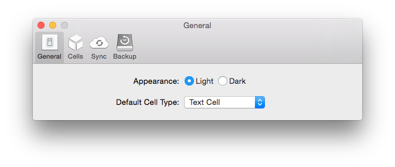
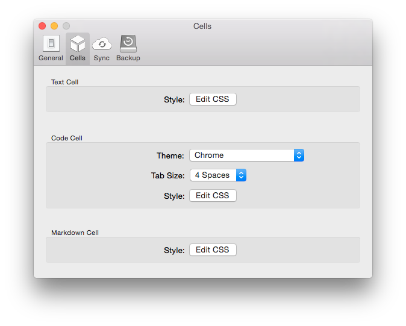
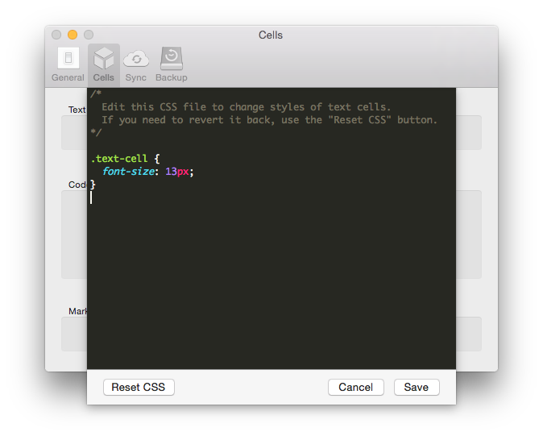

Quiver comes with two beautifully designed UI themes: a light theme and a dark theme. You can change the app appearance in the General tab.

In the Cells tab, you can set custom cell styles, such as font size, text color, background color, using standard CSS. The code cell theme is also set here.

The Sync and Backup tabs are already covered in previous notes.